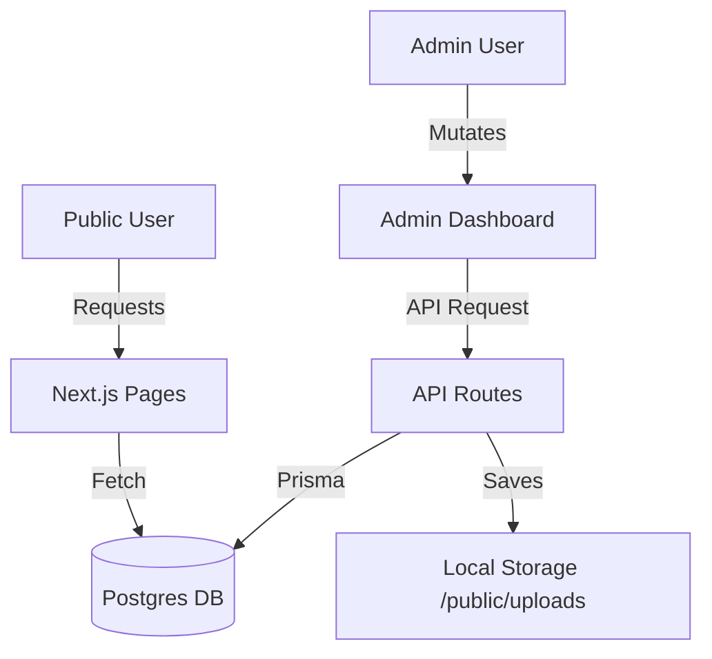

# Architecture: Dynamic Admin Panel

## Tech Stack
- **Framework**: Next.js 14 (App Router)
- **Database**: PostgreSQL with Prisma ORM
- **Auth**: NextAuth.js (Recommended)
- **Styling**: Tailwind CSS
- **Media**: Local Disk Storage (`/public/uploads`)

## Data Flow


## Directory Structure Updates
```text
/
├── app/
│   ├── admin/            # Admin Panel UI
│   │   ├── courses/      # Course Management
│   │   ├── team/         # Team Management
│   │   └── settings/     # Global Branding/Contact
│   ├── api/
│   │   ├── content/      # Content CRUD endpoints
│   │   └── upload/       # File upload handler
├── prisma/
│   └── schema.prisma     # Updated with dynamic models
├── public/
│   └── uploads/          # Folder for admin-uploaded assets
└── lib/
    └── db.ts             # Prisma client singleton
```

## Key Modules
- **Dynamic Content Loader**: High-level wrappers or custom hooks to fetch page-specific content.
- **Form System**: Valibot or Zod validated forms for consistent content updates.
- **Auth Guard**: Middleware or HOC to protect `/admin` routes.
